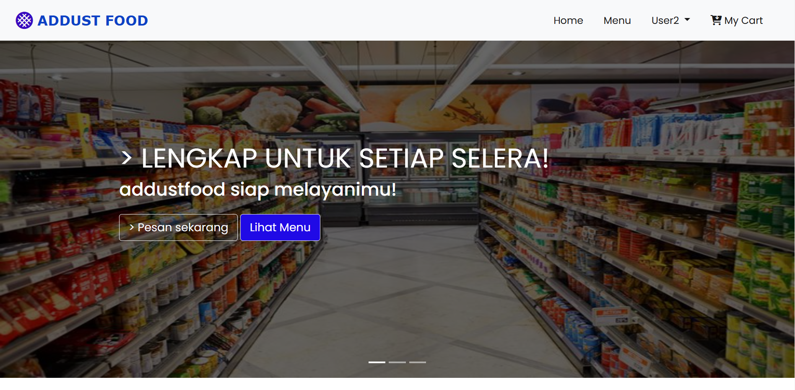

# README: E-Commerce Website Project

## Project Description
This project is a web-based e-commerce application built using **PHP** with the **CodeIgniter** framework. The application is designed to facilitate users in making online purchases and provide an easy management experience for admins through a dedicated dashboard.

### Key Features
#### User
- **Order Products**: Users can browse various product categories, add items to the cart, and complete purchases.
- **Payment**: The system supports multiple payment methods to ensure smooth transactions.
- **Transaction Reports**: Users can view their purchase history.

#### Admin Dashboard
- **Manage Menu**: Admins can add, edit, or delete menu items.
- **Manage Users**: A feature to manage user data, including access rights.
- **Manage Popular Menus**: Admins can mark and manage frequently purchased menus.
- **Manage Food Types**: Organize food items by type (e.g., snacks, beverages, etc.).
- **Manage Categories**: Add, edit, and delete product categories.

### Technologies Used
- **Backend**: PHP with CodeIgniter framework
- **Database**: MySQL
- **Frontend**: HTML, CSS, JavaScript
- **Additional Libraries**:
  - Bootstrap for styling
  - jQuery for interactivity
  - DataTables for dynamic tables and reports

### Installation
1. **Clone the Repository**
   ```bash
   git clone https://github.com/Andikafahrezi/addustfood.git
   ```
2. **Database Configuration**
   - Create a new database in MySQL.
   - Import the `addustfood.sql` file located in the `database/` folder into the database.
   - Update the database configuration in the `application/config/database.php` file.

3. **Configure Base URL**
   - Modify the `base_url` in `application/config/config.php` to match your application's URL.

4. **Run the Application**
   - Ensure your local web server (XAMPP, WAMP, etc.) is running.
   - Access the application via your browser using the appropriate URL.

### How to Use
#### Users
1. Register or log in to start using the application.
2. Add products to your shopping cart.
3. Proceed to the checkout page to complete your payment.

#### Admin
1. Log in using admin credentials.
2. Use the dashboard to manage menus, categories, users, and reports.

### Directory Structure
- `application/`: Contains CodeIgniter files (controllers, models, views).
- `assets/`: Contains static files like CSS, JS, and images.
- `database/`: Contains SQL files for the database structure.
- `uploads/`: Stores user-uploaded files (e.g., product images).

### Contribution
1. Fork this repository.
2. Create a new branch for your feature or fix.
   ```bash
   git checkout -b feature-name
   ```
3. Make changes and commit them.
   ```bash
   git commit -m "Add new feature"
   ```
4. Push the branch to your repository.
   ```bash
   git push origin feature-name
   ```
5. Create a Pull Request to the main repository.

### License
This project is licensed under the MIT License. See the `LICENSE` file for more details.

---

If you have any questions, feel free to contact [@andikafahrezzi](https://www.instagram.com/andikafahrezzi).